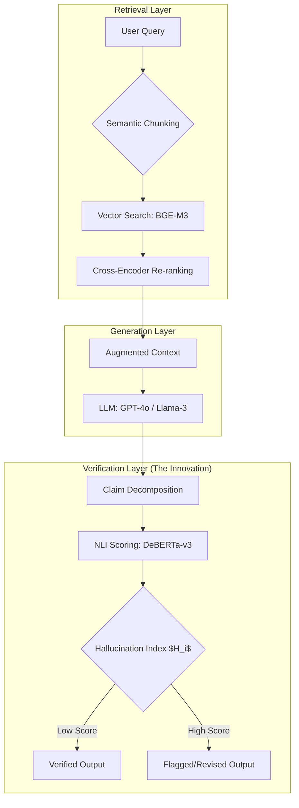

RAG_Search Systems
---

## 🖼️ Visual Assets & Documentation

### 1. The Architecture Diagram (Mermaid)

You can include this directly in your `README.md`. GitHub renders Mermaid code into clean, professional diagrams.



---

### 2. Experimental Result Charts (Python)

Use this script to generate the "Comparison Bar Chart" for your paper. This chart visualizes the drop in hallucination rates between your system and standard RAG.

```python
import matplotlib.pyplot as plt
import seaborn as sns

# Data from your results table
methods = ['Naïve RAG', 'RAG + Re-ranking', 'FactGuard-RAG (Ours)']
h_index = [0.18, 0.14, 0.04]  # Hallucination Index (lower is better)

sns.set_theme(style="whitegrid")
plt.figure(figsize=(10, 6))

# Create bar plot
ax = sns.barplot(x=methods, y=h_index, palette="viridis")

# Add formal labels for Scopus paper
plt.title('Comparative Analysis of Hallucination Rates', fontsize=15, fontweight='bold')
plt.ylabel('Hallucination Index ($H_i$)', fontsize=12)
plt.xlabel('Methodology', fontsize=12)
plt.ylim(0, 0.25)

# Annotate bars
for p in ax.patches:
    ax.annotate(format(p.get_height(), '.2f'), 
                (p.get_x() + p.get_width() / 2., p.get_height()), 
                ha = 'center', va = 'center', 
                xytext = (0, 9), 
                textcoords = 'offset points')

plt.savefig('docs/hallucination_comparison.png', dpi=300)
plt.show()

```

---

### 3. Folder Organization for Assets

In your GitHub repository, create a `/docs` folder to house these visuals. This makes it easy for reviewers to find the supporting evidence.

* `docs/architecture.png`: Exported Mermaid diagram.
* `docs/results_chart.png`: The output from the Python script above.
* `docs/sample_report.pdf`: A PDF showing one "Factuality Report" generated by the system.

---

## 🚀 Final Checklist for Submission

1. **Code Availability:** Ensure your GitHub repo is public and the link is in the paper.
2. **Reproducibility:** Double-check that `requirements.txt` is complete.
3. **Visuals:** Ensure all charts have a high DPI (300+) and clear, readable axes.

**Would you like me to draft a "Cover Letter" for your Scopus journal submission that highlights the novelty of your Hallucination Tracker?**
